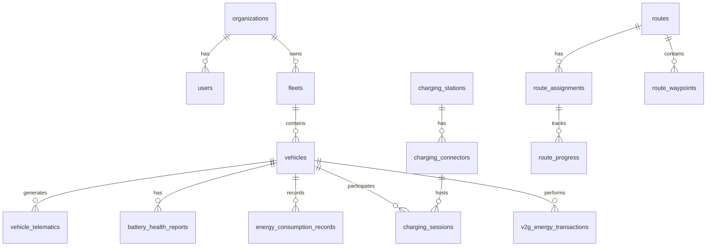

# GIU AI EV Fleet Management System Database Schema

This document describes the PostgreSQL database schema for the GIU AI EV Fleet Management System. The schema is designed to support AI-driven features, real-time monitoring, and advanced analytics while maintaining scalability and performance.

## Schema Components

### 1. Core Entities & User Management (`schema.sql`)
- Organizations with subscription plans and contact info
- Users with role-based access control
- Roles and permissions with many-to-many mapping
- Default roles (SuperAdmin, OrgAdmin, FleetManager, Driver, Analyst)
- Automatic timestamp updates via triggers

### 2. Fleet & Vehicle Management (`fleet_schema.sql`)
- Fleets and vehicles with EV-specific attributes
- Vehicle telematics with live and historical data
- Monthly partitioned tables for telematics history
- Spatial indexing for vehicle locations
- Status constraints and validation
- Active vehicles status view

### 3. Charging Infrastructure (`charging_schema.sql`)
- Charging stations with location and availability tracking
- Connectors with power output and pricing
- Charging sessions with V2G support
- Active charging sessions view
- Spatial indexing for station locations
- Real-time availability monitoring

### 4. Routes & Optimization (`routes_schema.sql`)
- Routes with assignments and waypoints
- Sequence-based waypoint tracking
- Integration with charging sessions
- Active routes status view
- Route optimization history
- Spatial indexing for route planning

### 5. Battery & Energy Management (`energy_schema.sql`)
- Battery health reports and trends
- Energy consumption records (monthly partitioned)
- Energy efficiency analysis
- V2G energy transactions
- Materialized views for analytics
- Automated refresh functions

## Key Features

### PostGIS Integration
- Spatial data types for locations (GEOGRAPHY)
- GiST indexes for spatial queries
- Support for route optimization and nearest-station queries

### Data Partitioning
- Monthly partitions for high-volume tables:
  - Vehicle telematics
  - Energy consumption records
  - Charging session metrics

### Advanced Indexing
- B-tree indexes for regular columns
- GiST indexes for spatial data
- Covering indexes for common queries
- Unique constraints where appropriate

### JSONB Storage
- Flexible metadata storage
- Weather conditions
- Vehicle settings
- Organization preferences

### Materialized Views
- Battery health trends
- Energy efficiency metrics
- Automated refresh mechanisms

### Real-time Analytics
- Active vehicle status
- Charging session monitoring
- Route progress tracking
- Energy efficiency calculations

## Database Maintenance

### Partition Management
- Monthly partitions are created for:
  - `vehicle_telematics`
  - `energy_consumption_records`
  - `charging_session_metrics`
- New partitions should be created before each new month

### View Refresh
- Materialized views should be refreshed periodically:
  - `battery_health_trends`: Daily refresh recommended
  - Use `refresh_battery_health_trends()` function

### Index Maintenance
- Regular VACUUM and ANALYZE operations recommended
- Monitor index usage and performance
- Consider reindexing based on fragmentation

## Best Practices

### Data Integrity
- Foreign key constraints ensure referential integrity
- Check constraints validate data ranges
- Triggers maintain audit timestamps
- Unique constraints prevent duplicates

### Performance
- Partitioned tables for high-volume data
- Materialized views for complex aggregations
- Efficient indexing strategy
- Query optimization considerations

### Security
- Role-based access control
- Organization-level data isolation
- Audit trails via timestamps
- Secure connection requirements

## Getting Started

1. Install required PostgreSQL extensions:
```sql
CREATE EXTENSION IF NOT EXISTS "uuid-ossp";
CREATE EXTENSION IF NOT EXISTS postgis;
CREATE EXTENSION IF NOT EXISTS btree_gist;
CREATE EXTENSION IF NOT EXISTS timescaledb;
```

2. Create the schema in order:
```sql
\i schema.sql
\i fleet_schema.sql
\i charging_schema.sql
\i routes_schema.sql
\i energy_schema.sql
```

3. Set up initial data:
- Create default roles and permissions
- Set up organization
- Configure initial fleet settings

4. Schedule maintenance tasks:
- Partition creation
- View refreshes
- Index maintenance
- Data archival

## Schema Diagram

The schema includes the following main relationships:

